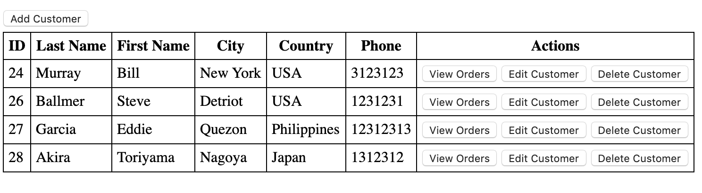
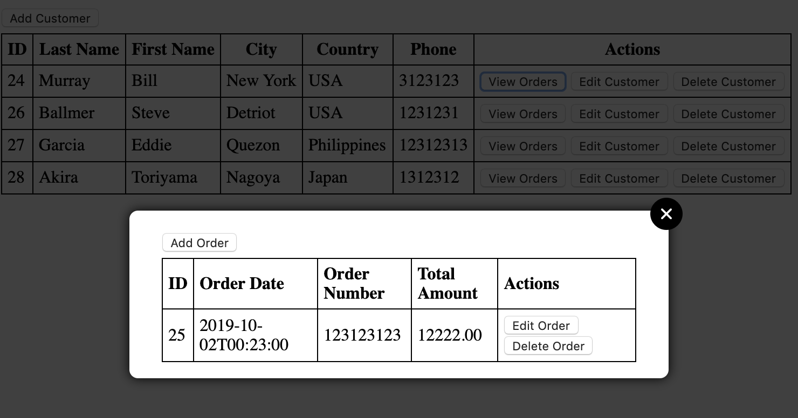

# spring-jpa

## Prepare Database
Application uses MySQL as database.  Execute this [database schema scripts](spring-jpa/src/main/resources/scripts/schema.sql).
DB credentials are maintained in [application properties](spring-jpa/src/main/resources/application.properties).

## Running Application
Go to spring-jpa folder and execute
```
mvn spring-boot:run
```
## Application Screen Capture


